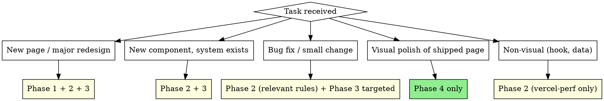

# Frontend Workflow

Coordinates frontend-specific skills with the superpowers development lifecycle. Does not replace superpowers — defines four intervention points where frontend work is injected (Design / Constrain / Audit / Polish).

## Target Stack

Web-only: React + Next.js (App Router) + shadcn/ui + Tailwind. Mobile-only rules (haptic, Dynamic Type, safe areas, swipe-back) do NOT apply.

## Scope Check



Polish triggers (`polish` / `美化` / `refine` / `視覺太樸素` / ...) go directly to Phase 4. Skip Phase 1 unless polish reveals the design system itself needs revision.

## Four-Phase Lifecycle

```
brainstorming → [P1 Design] → writing-plans (+ P2 Constrain per task) → execute → [P3 Audit] → verify → review → finish

[P4 Polish]  ← invoked independently whenever the user asks for visual refinement of a shipped page
```

---

## Phase 1 — Design

Runs after `superpowers:brainstorming` approves the spec. Produces a design brief specific enough that implementers cannot make arbitrary visual choices.

**Hard gate:** `brainstorming` normally auto-invokes `writing-plans`. Under frontend-workflow, brainstorming MUST stop at spec approval and return here. After Phase 1 completes, frontend-workflow invokes `writing-plans`.

### Step 1 — Data-driven recommendations

Run `ui-ux-pro-max:ui-ux-pro-max` to generate design-system recommendations. If `design-system/MASTER.md` already exists for this product, read it first and use `--domain` searches for incremental needs instead of regenerating.

### Step 2 — Creative direction (REQUIRED)

**REQUIRED SUB-SKILL:** Invoke `frontend-design:frontend-design`.

Use Step 1 output as input, not as final answer. `frontend-design` commits to specific, distinctive decisions:

- Exact color assignments with semantic meaning
- Typography weights / sizes / tracking per role
- Motion: which elements animate, easing, duration
- Layout: grid structure, hierarchy, spacing rhythm
- One signature interaction

If `frontend-design` wants a direction different from Step 1, re-validate with targeted `--domain` searches. Data-informed, not data-constrained.

### Step 3 — Token structure

Extend shadcn's CSS variables (`--primary`, `--muted`, etc.); never replace them. Only add new tokens when shadcn's set is insufficient.

**Output:** a design brief document. Then invoke `superpowers:writing-plans`.

---

## Phase 2 — Constrain

Runs during `superpowers:writing-plans`. Each task in the plan must embed task-type-matched constraints from three sources.

### Source 1 — shadcn Critical Rules

**REQUIRED:** Read the `shadcn` skill for current rules. Apply to every task that creates or modifies visible UI.

| Category | Key rules |
|---|---|
| Styling | `gap-*` not `space-y-*`; semantic colors (`bg-primary`) not raw; `size-*` for equal dimensions; `cn()` for conditional classes; no manual `dark:` overrides; no manual `z-index` on overlays |
| Composition | Items inside Groups (`SelectItem` → `SelectGroup`); full Card composition; Dialog/Sheet/Drawer need Title; Avatar needs Fallback |
| Forms | `FieldGroup` + `Field`; `InputGroupInput` inside `InputGroup`; `ToggleGroup` for 2–7 options; `data-invalid` + `aria-invalid` |
| Icons | `data-icon` on icons in Button; no sizing classes on icons inside components; pass as objects not strings |

When adding a new shadcn component, always `pnpm dlx shadcn@latest docs <component>` first.

### Source 2 — vercel-react performance rules

**REQUIRED:** Read `vercel-react-best-practices` for the full list. Match by task type:

| Task involves | Apply |
|---|---|
| Data fetching | `async-*` (CRITICAL) + `server-*` (HIGH) + `client-*` |
| New component | `bundle-*` (CRITICAL) + `rerender-*` + `rendering-*` |
| Interactive UI (forms, charts) | `rerender-*` + `rendering-*` + `js-*` |
| Heavy libs (charts, Motion, editors) | `bundle-dynamic-imports` (CRITICAL) — `next/dynamic` with `ssr: false` |

### Source 3 — ui-ux-pro-max UX rules (Web-filtered)

Skip mobile-only sections (haptic, Dynamic Type, safe areas, swipe-back, tab bar iOS, top app bar Android).

| Task involves | Apply |
|---|---|
| Any visible UI | §1 Accessibility: 4.5:1 contrast, focus rings, aria-labels, keyboard nav |
| Clickable elements | §2 Touch & Interaction: 44px targets, loading feedback, cursor-pointer |
| Images or async content | §3 Performance: dimensions declared, skeleton >300ms, lazy loading |
| Forms | §8: visible labels, inline validation, error near field |
| Charts / tables | §10: legends, accessible colors, responsive reflow |
| Navigation | §9: predictable back, deep linking, nav state highlight, breadcrumbs |
| Animations | §7: 150–300ms, transform/opacity only, `prefers-reduced-motion` |

### Plan is incomplete if ...

- Visible-UI task has no shadcn composition rule
- Data-fetching task has no `async-*` or `bundle-*` rule
- Visible-UI task has no §1 Accessibility rule

Revise before execution.

---

## Phase 3 — Audit

Runs after execution (via `subagent-driven-development` or `executing-plans`), before `verification-before-completion`. Catches what Phase 2 missed.

1. **Guidelines audit** — **REQUIRED SUB-SKILL:** Invoke `web-design-guidelines`. Fetch live rules, read changed files, fix compliance issues. Not replaceable by visual checks.
2. **UX quality check** — Run ui-ux-pro-max §1 + §2 + §3 against all changed files (contrast ≥ 4.5:1, focus rings, 44px targets, CLS prevention, skeleton >300ms).
3. **shadcn composition check** — no `space-y-*`, no raw colors, correct composition, `data-icon` on button icons, forms use `FieldGroup` + `Field`.
4. **Build + bundle** — `pnpm build` succeeds with zero errors. Heavy libs (Motion, charts) must appear in dynamic chunks, not main bundle. `ANALYZE=true pnpm build` if `next-bundle-analyzer` is available.

---

## Phase 4 — Polish (Screenshot-in-the-Loop)

For visual refinement of an **already-shipped** page. Not for initial design (Phase 1). Not for bug fixes (Phase 2+3).

### Prerequisites

- `Playwright:*` MCP connected (`claude mcp list | grep playwright`). If missing: `claude mcp add --scope project playwright -- npx -y @playwright/mcp@latest --headless`, then restart.
- `~/.claude/design-references/REFERENCES.md` — seed URL list, categorized by tags.
- Dev server reachable at a known URL.
- Project `MASTER.md` — polish respects existing tokens (color/font/shadow); structure, spacing, motion, density are open.
- **Viewport convention:** capture and compare at **1440 × 900** (desktop first). Add 390 × 844 only if mobile-specific issue.

### The Loop (one page per cycle — never batch)

1. **Capture current state.** Use `Playwright:browser_navigate` then `Playwright:browser_take_screenshot`. Save to `<project-root>/references/<page>/current-<HHMMSS>.png` (must be gitignored).
2. **Select references.** Read `~/.claude/design-references/REFERENCES.md`. Filter by page category tag (`dashboard`, `form`, `landing`, `empty-state`, ...) and aesthetic tags matching MASTER.md. Pick **3–5** only.
3. **Fetch references (cache-first).** For each URL check `~/.claude/design-references/cache/<slug>/`. Reuse if <14 days old. On miss: `Playwright:browser_navigate` → `Playwright:browser_take_screenshot` of the relevant **section** (sidebar / card grid / empty state), not always the full page. Save as `cache/<slug>/<descriptor>.png`. Slug = URL host, lowercase dashed (e.g. `claude-ai`).
4. **Delta analysis.** List **concrete deltas**, not vibes. Delta focus order:
   1. Information hierarchy (what's hero vs secondary)
   2. Spacing rhythm (gutters, section gaps, padding)
   3. Typography scale + tracking
   4. Empty-state / zero-state
   5. Color accent placement (not palette — locked by MASTER.md)
   6. Interaction states (hover / focus / pressed) — simulate with `Playwright:browser_hover` before screenshotting
   7. Motion moments (1–2 signatures per page, not everywhere)
   8. Hairline details (dividers, shadows, radii)

   **Example of good delta:** *"Reference uses 48px gutter between card grid and page header, with a hairline divider between section title and grid. Ours has 16px gutter and no divider — the grid reads as a continuation of the header instead of a distinct section."* (not: "this looks plain")
5. **Propose code.** Smallest diff addressing the top 3 deltas. One page per cycle. Never introduce new colors / fonts / radii — those belong to Phase 1.
6. **Apply → re-screenshot → compare.** Another `Playwright:browser_take_screenshot`. Improved → commit, next delta. Regressed → revert, try a different angle (often spacing is the real issue, not the flashy one).
7. **Stop when:** top 3 deltas fixed and no Audit 1–3 red flags remain, OR 3 iterations yield diminishing returns, OR polish reveals a design-system issue (→ route back to Phase 1).

### Reference expansion

When seed list is insufficient: navigate a curated gallery (Godly / Land-book / Httpster for web; Mobbin for mobile). Screenshot 5–10 relevant items, append URLs + tags to the ad-hoc pool in `REFERENCES.md`. Respect rate limits — navigate serially.

### Red flag — escalate to Phase 1

If polish requires changing the primary color, swapping the display font, or restructuring the grid system — **stop**. That's design-system work. Update MASTER.md via Phase 1, then re-enter Phase 4.

---

## Superpowers Integration Map

| Lifecycle step | Superpowers skill | frontend-workflow injects |
|---|---|---|
| Requirements | `superpowers:brainstorming` | Override terminal state — stop at spec approval |
| Design | — | **Phase 1** (ui-ux-pro-max + frontend-design) |
| Planning | `superpowers:writing-plans` | **Phase 2** constraints per task |
| Workspace | `superpowers:using-git-worktrees` | (use as-is) |
| Execution | `superpowers:subagent-driven-development` | Subagents follow Phase 2 constraints |
| Audit | — | **Phase 3** (web-design-guidelines + UX + shadcn + build) |
| Verification | `superpowers:verification-before-completion` | (use as-is) |
| Review | `superpowers:requesting-code-review` | (use as-is) |
| Completion | `superpowers:finishing-a-development-branch` | (use as-is) |
| Post-ship polish | — | **Phase 4** (Playwright MCP + `~/.claude/design-references/`) |

## Rationalization Table

| Excuse | Reality |
|---|---|
| "Requirements are clear, skip brainstorming" | Brainstorming produces the product context the design-system query depends on |
| "MASTER.md exists, skip Phase 1 entirely" | Use `--domain` for incremental needs. Full regeneration only for new product domains |
| "ui-ux-pro-max decided everything, skip frontend-design" | ui-ux-pro-max recommends; frontend-design commits and differentiates |
| "shadcn rules are obvious, no need to embed in plan" | Execution subagents don't have shadcn loaded — constraints must be explicit per task |
| "Manual visual check replaces the guidelines audit" | Live-URL rules update after other skills were authored. Run the audit skill |
| "Build succeeded, performance is fine" | Build success ≠ bundle efficiency. Check for main-bundle bloat |
| "Polish without screenshot — I know what to change" | Blind edits miss. Screenshot first, every loop |
| "WebFetch a reference for its visuals" | HTML-only; misses the actual look. Always Playwright |
| "Re-capture references every loop" | Waste. 14-day cache window |
| "Change a color during polish because reference uses a different one" | Tokens are Phase 1 territory. New tokens require escalating to Phase 1 |
